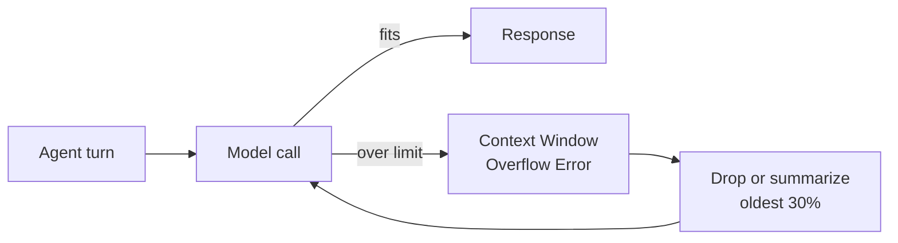
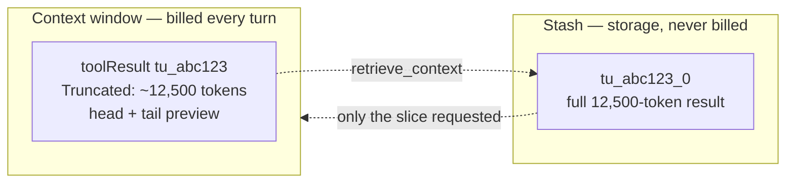
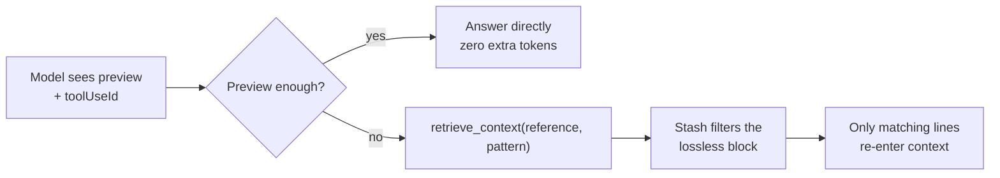
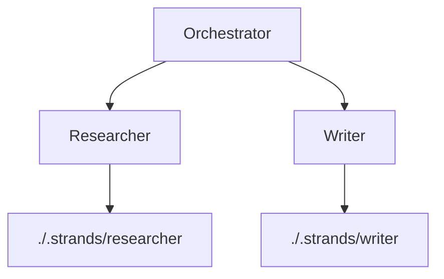

When developing agentic systems, the limited width of the context window quickly becomes one of your most sacred and scarce resources. The Strands team has come to know this well: Model performance degrades under context bloat, causing bugs to bubble up in code; Applications hit context window overflows and crash; Agents get stuck in loops attempting to access the context they just shrunk. Meanwhile, token costs continue to rise.

With this in mind, we developed a tiered approach to the curation of the model's context window, ensuring context is dropped, but never forgotten.

## Philosophy

Historically, at their inception, agentic systems relied upon rudimentary "Conversation Managers", which acted as a stopgap between the application and the dreaded Context Window Overflow Error. In Strands, a Conversation Manager would merely catch a Context Window Overflow Error returned by the model call once the context window had surpassed its limit, then either it would drop (or summarize) the oldest 30% of its context to be able to free up space in the context window, reinvoke the model, and recover gracefully.



While this approach enabled the advent of model-driven applications, it was far from ideal. Each Context Window Overflow Error meant that an entire turn was wasted, requiring re-invocation of the model at a high token cost, and the reduction was indiscriminate: the oldest messages went first, whether or not they were the ones the agent still needed.

Applying the Just-In-Time standard to context management, we hypothesized that in an ideal world, the context window would exclusively contain only the information that is purely sufficient and necessary for the next model call. Any information that is not necessary for the current turn, would remain accessible and lossless outside of the limited context window space. This would minimize not only token spending, but the "lost-in-the-middle effect" where model performance degrades (especially over information located in the middle of a data source) when faced with larger inputs.

### Context Compression

The first step in our methodology required determining representations of data in the context window. Depending on the type of data in the context window, one must determine a representation that optimizes its compactness in comparison to its lossiness. This representation often varies depending on use case. For instance, for bulky tool output one can simply use truncated versions of the previous context, whereas conversational agents may condense conversation history in summaries, and coding agents may use tree-sitter or language-native APIs to maintain only function headers.

In Strands, each representation is a strategy, and strategies run as an ordered pipeline against the targets you name:

```python
from strands import Agent
from strands.experimental.context_manager import Offload

agent = Agent(
    context_manager={
        "strategies": [
            # Bulky tool output collapses to a head/tail preview as soon as a block exceeds 1,500 tokens
            Offload.truncate("tool_results", {"preview_tokens": 750}).when(threshold=1500),
            # Conversation history condenses into a summary once the window is 85% full
            Offload.summarize("*").when(utilization=0.85, preserve_recent=4),
        ],
    },
)
```

A truncated block keeps its head and tail and states plainly what was removed, so the model can tell both what the content was and that there is more of it to ask for:

```text
[Truncated: 1 block, ~12,500 tokens]

$ terraform plan
module.network.aws_vpc.main: Refreshing state... [id=vpc-0a1b2c3d]

[... 48,231 chars elided ...]

Plan: 3 to add, 0 to change, 0 to destroy.
```

### Context Persistence

Although compressing context clears out room for further conversations, it loses critical data, leading to forgetfulness, duplicate tool calls, and increased token usage.

We resolved this in Strands by maintaining a lossless copy of any context that has been sent to the agent in a log colloquially known as the "stash". Since this "stash" is maintained in storage independently of the agent's context window, the agent is able to empty its context window without sacrificing any information. Now, the compacted versions of context are able to act as previews for the agent to retrieve the full context blocks as needed.



Every content block is written to the stash on arrival, before any strategy runs, under a deterministic key of `toolUseId_blockIndex`. Because the key is derived from the `toolUseId` the model already sees in context, a preview is addressable without spending tokens on a lookup table. The stash defaults to in-memory storage; point it at a durable backend to survive process restarts:

```python
from strands import Agent
from strands.storage import LocalFileStorage

agent = Agent(
    context_manager={
        "stash": {"storage": LocalFileStorage("./.strands/stash")},
    },
)
```

## Context Relevance

Yet, this begets a new set of problems: how does the agent know what full context to retrieve? Strands registers a `retrieve_context` tool by default, and the agent addresses the stash through it. Rather than paying to pull a 12,500-token result back into the window, the agent can name the slice it wants — a regex match with surrounding lines, or an explicit line range:

```python
# Grep the stashed block for matching lines
{"reference": "tu_abc123_0", "pattern": "Error|destroy"}

# Read one specific span
{"reference": "tu_abc123_0", "line_range": {"start": 10, "end": 25}}

# Or pull the whole thing back, if it really is all needed
{"reference": "tu_abc123_0"}
```



For context that lives in storage rather than the stash, our built-in Search Strategies handle ranking on your behalf, vending algorithms that return the top-k relevant results — including BM25 and lexical keyword search, with extension support for any custom search:

```python
from strands.storage import LocalFileStorage
from strands.storage.search import Bm25SearchStrategy

storage = LocalFileStorage(
    "./.strands/artifacts",
    search_strategy=Bm25SearchStrategy(),
)
```

Content is indexed on write, so `await storage.search("context window overflow")` returns scored results ranked best-first, and the agent pulls back only the entries that actually matched.

## Context Isolation

Once the context window has been curated specifically for a task, an orchestrator agent may launch sub-agents for isolated tasks, allowing the context window to remain task-specific and minimal. In Strands, Storage is decoupled from any one construct, so a user can isolate their agent's context across sessions, multi-agent patterns, or subagents simply by passing a different path into the Context Manager.

```python
from strands import Agent
from strands.storage import LocalFileStorage

researcher = Agent(
    agent_id="researcher",
    storage=LocalFileStorage("./.strands/researcher"),
    context_manager="auto",
)

writer = Agent(
    agent_id="writer",
    storage=LocalFileStorage("./.strands/writer"),
    context_manager="auto",
)
```



Even on a shared backend the stash namespaces every entry by session and agent ID, so one agent's offloaded context is never visible to another. Handing each agent its own path simply makes that boundary physical.

[insert conclusion here]
